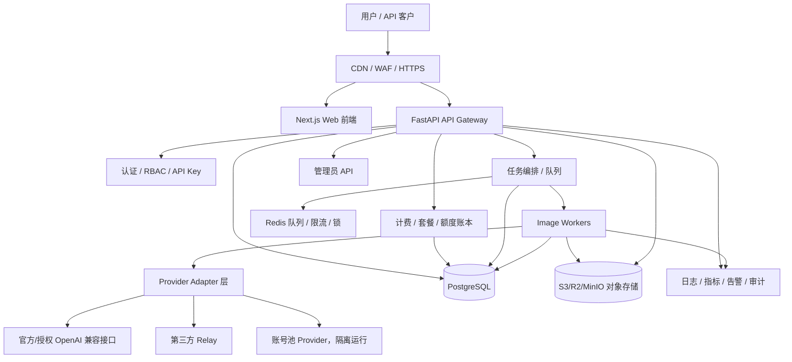

# 图像生成服务商业化/正式对外设计方案

适用目录：`C:\Users\caiwujiang\Desktop\image`

生成日期：2026-07-06

当前执行进度（更新至 2026-07-18）：

- 已确定 `chatgpt2api-bk` 为商业化主线项目。
- 四个组件均已建立独立个人仓库，父仓库通过固定子模块提交统一交付。
- 已完成目标 Outlook 账号注册、AT 刷新、代理链路、账号池导入和真实图片生成验收。
- 已为图片 SSE 增加总超时，避免静默上游永久占用 Worker。
- 已完成前端质量门禁收口：`eslint`、`tsc --noEmit`、`npm run build` 可作为发布前检查。
- 已完成后端测试分层：真实 HTTP 集成测试默认跳过，单元/API 测试可稳定本地运行。
- 已落地商业化第一块核心能力：额度账本 `quota_ledger`，覆盖人工发放、CDK 兑换、消费扣减、退款返还、管理员直接设置。
- 已为数据库存储增加专用 `quota_ledger` 表，保留从旧通用集合迁移的兼容路径。
- 已在管理后台增加额度流水筛选、查看、CSV 导出；已在用户兑换页增加“我的额度流水”。
- 已启动任务队列阶段：新增异步图片任务 `image_jobs`、内置 Worker、任务查询/取消/管理员执行入口，并接入失败/取消自动退款。
- 已启动图片资产阶段：新增本地对象存储目录 `data/assets`、`image_assets` 元数据、用户/管理端资产 API，生成成功后自动归档，管理后台展示最近图片资产。
- 已完成对象存储抽象第一版：`OBJECT_STORAGE_BACKEND=local|s3|r2|minio`，S3 兼容后端可配置 endpoint/bucket/CDN/prefix，R2/MinIO 可共用该适配层。
- 已完成订单 / 支付 / 套餐履约 MVP：新增 `orders`、`payments`，用户可创建套餐订单，管理员或模拟支付回调可幂等确认支付，支付成功自动发放额度并写入 `quota_ledger(ref_type="order")`。
- 已补齐真实支付回调签名框架第一版：新增 `services/payment_webhook_service.py` 与 `POST /api/payments/webhook/{provider}`，支持 HMAC-SHA256 验签、事件解析、幂等支付入账与自动履约。
- Signed webhook refund events now share the same idempotent order-refund and quota-clawback path.
- 已补齐用户自助支付入口第一版：`POST /api/orders/{order_id}/checkout` 可生成 manual/redirect/Stripe Checkout 支付会话，用户端创建订单后自动生成支付入口，管理端可为待支付订单生成/复制支付链接；支付成功仍以签名 webhook 为准。
- 已启动生产数据库表结构升级：数据库存储后端已为 `users`、`packages`、`cdks`、`redemptions`、`orders`、`payments`、`image_jobs`、`image_assets`、`audit_logs`、`launch_evidence`、`auth_sessions`、`auth_action_tokens` 增加专用表，并保留从旧 `storage_collections` 自动迁移的兼容路径。
- 已启动 Redis 队列/分布式锁阶段：新增 `IMAGE_JOB_QUEUE_BACKEND=redis` 可选后端，异步图片任务可写入 Redis 队列并使用 Redis lock 防止多 Worker 重复执行，默认仍保留 `storage` 轮询模式。
- 已补齐可靠队列第一版：支持失败重试、最终失败写 dead-letter、运行中任务 stale recovery，管理员可通过 `/api/admin/jobs/recover-stale` 手动触发恢复。
- 已补齐 dead-letter 运维闭环：管理员可查看死信任务、将死信任务重新入队；重新入队会为注册用户重新预扣额度并写入账本，避免失败退款后免费重试。
- 已补齐轻量数据库迁移体系：新增 `schema_migrations` 版本表、迁移 runner、`scripts/migrate_database.py` CLI、`--status` / `--dry-run` 运维入口，并在数据库健康检查中暴露已应用迁移版本。
- 已补齐管理操作审计日志第一版：新增持久化 `audit_logs`、管理端查询 API、前端“审计日志”查看入口；生产入口会自动记录管理端写操作，并对 password/token/secret/api_key 等敏感字段做脱敏。
- 已补齐备份/验证/恢复演练第一版：新增 `services/backup_service.py` 与 `scripts/backup_data.py`，支持备份 `data/`、本地资产、脱敏配置、SQLite 快照、PostgreSQL `pg_dump`，并通过 manifest + sha256 校验与恢复脚本完成本地演练。
- 已补齐监控与告警第一版：新增 `services/monitoring_service.py`、`/health/live`、`/health/ready`、`/api/admin/metrics`、`/api/admin/alerts`，覆盖存储/对象存储/队列健康、核心业务计数、队列积压、dead-letter、卡死任务、磁盘空间和备份新鲜度告警，并支持 Prometheus 文本格式。
- 已补齐经营报表第一版：新增 `services/reporting_service.py` 与 `GET /api/admin/business-report`，管理端“经营报表”可查看用户、订单、支付收入、额度流水、图片任务成功率、dead-letter、资产容量和基于 `COST_PER_IMAGE_CENTS` 的估算毛利。
- 已补齐生产安全响应头与合规页面第一版：新增 CORS 正式域名白名单、HTTPS 强制跳转开关、HSTS、CSP/X-Frame-Options 等安全响应头，以及 `/legal/terms`、`/legal/privacy`、`/legal/refund` 用户协议/隐私政策/退款说明页面。
- Customer support ticket MVP is now implemented: users can submit/reply at `/support`; admins can triage from Settings > Support tickets with public replies, internal notes, screenshot/PDF/log attachments stored through object storage, status/priority/assignee updates, and persistence in the dedicated `support_tickets` table, priority-based first-response/resolution SLA fields, optional email notifications and SLA overdue admin alerts.

## 1. 结论

当前项目已经从“内部使用/演示/小规模内测”向商业化底座推进：质量门禁和额度账本已经落地。下一阶段重点是把主存储、队列、对象存储和支付履约补齐，使系统从“单机可用”升级为“可审计、可计费、可扩展、可恢复”的 SaaS 架构。

建议商业化版本以 `chatgpt2api-bk` 作为主产品底座：

- 保留它已有的 Next.js 管理前端、注册/登录、用户额度、CDK、API key、账号池、OpenAI 兼容接口。
- 把 `image-gen-demo` 中更成熟的能力吸收进来：任务队列、作品库、使用统计、Relay 配置、CSV 导出、管理员视角。
- `image-gen-demo` 后续作为原型/备用工具，不作为正式公网入口。

## 2. 当前项目定位

### 2.1 `image-gen-demo`

优点：

- 轻量，单 FastAPI 文件即可运行。
- 图片生成、编辑、账号池代理、Relay 路由、用户 key、额度、任务队列、作品库、使用统计都已有雏形。
- 本地测试已通过：`tests.test_admin_features` 共 29 个测试通过。

不足：

- `main.py` 约 2100 行，后续维护成本高。
- 前端是大 HTML + 内联 JS，难以长期迭代。
- 本地 JSON/JSONL 文件不适合作为商业化主存储。
- token 存在 localStorage，公网场景风险偏高。

### 2.2 `chatgpt2api-bk`

优点：

- 已有 Next.js 前端、用户系统、CDK、套餐、权限、API key、账号池管理。
- 已支持 json/sqlite/postgres/git 多存储后端雏形。
- 更适合作为正式产品的主线。

不足：

- PostgreSQL/Redis/S3 还没有完全成为生产默认路径。
- 当前后端仍是进程内服务对象，正式多实例部署前还需要数据库事务、分布式锁和任务队列。
- 支付签名回调框架、订单履约、Redis 化队列、对象存储图片管线已落地 MVP；真实生产仍需对接具体支付宝/微信/Stripe 凭据并做端到端验收。
- HttpOnly Cookie、邮箱验证、找回密码与邮件发送闭环已落地；真实生产仍需配置 SMTP/Resend 凭据并做端到端收信验收。
- 公网登录、注册、找回密码、CDK 兑换和 API key 调用限流已具备 Redis 后端，支持多实例共享计数；本地仍可使用 memory 后端。
- 订单收据能力已落地：已支付/已履约订单可通过用户或管理员 API 获取 JSON/HTML 收据，收据使用生产环境商业主体配置。
- Order refund after-sales loop is now implemented: admins can refund fulfilled orders, deduct the full granted quota when the user balance is sufficient, mark the payment/order as refunded, generate RFND credit-note receipts, and keep the action idempotent.
- The signed payment webhook now also handles refund events such as `refund.succeeded`, `charge.refunded`, `payment.refunded`, `refund_success`, and `refunded`, delegating to the same idempotent refund/order clawback path.
- Payment webhook provider adapters now cover Stripe-style signatures, HMAC-normalized Alipay payloads, decrypted/gateway-normalized WeChat Pay resources, and `scripts/payment_webhook_sandbox.py` for local signed replay of paid/refund events.
- Remote verifier can replay signed payment paid/refund webhooks against a disposable order and include `payment_webhook_paid_replay` / `payment_webhook_refund_replay` in launch evidence.
- 管理端“生产上线预检”已补齐“支付 webhook 一键验收”：自动创建临时套餐/用户/订单，使用服务器支付 webhook secret 签名回放 paid + refund，验证履约、退款和额度扣回，并归档 `launch_evidence`。
- Admin launch UI now includes Checkout end-to-end acceptance: `/api/admin/checkout-webhook/replay` creates temporary checkout fixtures, generates checkout entry/session, replays signed paid/refund webhooks against the same order, verifies fulfillment/refund/quota clawback, disables fixtures and archives `payment_checkout_*` evidence.
- Remote verifier can now create disposable checkout fixtures and include `payment_checkout_order_created` / `payment_checkout_session_created` in launch evidence; `--checkout-webhook-replay` can also sign paid/refund webhooks against the same disposable checkout order and include `payment_checkout_paid_replay` / `payment_checkout_refund_replay`.

## 3. 商业化目标架构



## 4. 服务拆分建议

### 4.1 正式公网入口

只暴露一个主域名，例如：

- `https://img.example.com`：Web 前端和用户控制台。
- `https://api.example.com`：OpenAI 兼容 API，可选。

也可以先用一个域名：

- `/`：Web。
- `/v1/*`：OpenAI 兼容 API。
- `/api/*`：业务 API。
- `/admin/*`：管理员后台。

### 4.2 后端模块

建议将 `chatgpt2api-bk` 后端拆成这些包：

```text
api/
  routes/
    auth.py
    users.py
    api_keys.py
    images.py
    jobs.py
    gallery.py
    billing.py
    admin.py
    provider_accounts.py
services/
  auth_service.py
  quota_service.py
  billing_service.py
  job_service.py
  image_service.py
  provider_router.py
  provider_adapters/
    openai_compatible.py
    relay.py
    account_pool.py
  audit_service.py
  notification_service.py
storage/
  models.py
  migrations/
workers/
  image_worker.py
  maintenance_worker.py
```

### 4.3 `image-gen-demo` 能力迁移清单

从 `C:\Users\caiwujiang\Desktop\image\image-gen-demo` 迁移到主项目：

- `/api/jobs/*` 服务端任务队列。
- `/api/gallery/*` 作品库。
- `/api/usage` 使用统计。
- `/api/usage/export.csv` CSV 导出。
- Relay 动态配置。
- 账号池异常清理逻辑。
- 上游 401/403 映射为本服务 502 的错误处理方式。
- SSRF 防护逻辑：图片 URL 下载时禁止内网地址、loopback、link-local。

## 5. 数据存储设计

正式商业化不要再依赖本地 JSON/JSONL 作为主数据源。

### 5.1 PostgreSQL 表设计

核心表：

```text
users
sessions
api_keys
plans
subscriptions
orders
payments
quota_ledger
usage_events
image_jobs
image_assets
provider_configs
provider_accounts
audit_logs
login_attempts
rate_limit_events
```

当前已落地的数据库专用表：

```text
users
packages
cdks
redemptions
orders
payments
quota_ledger
image_jobs
image_assets
audit_logs
launch_evidence
auth_sessions
auth_action_tokens
```

说明：

- `quota_ledger` 已是 append/upsert 专用表，支持按用户、类型、关联对象查询。
- `orders`、`payments`、`image_jobs`、`image_assets`、`auth_sessions`、`auth_action_tokens` 等商业核心集合已从通用 `storage_collections` 升级为带查询列的专用表。
- 旧环境如果已经把这些集合写入 `storage_collections`，首次加载时会自动迁移写入专用表，避免直接丢历史数据。
- 通用 `storage_collections` 仍保留给非核心扩展数据使用。
- 已落地轻量 migration runner：
  - `schema_migrations` 表记录已执行版本。
  - `services/storage/migrations/` 保存版本清单和执行器。
  - `scripts/migrate_database.py --database-url ...` 可执行迁移。
  - `scripts/migrate_database.py --status` 可查看当前版本。
  - `scripts/migrate_database.py --dry-run` 可预览待执行版本。
  - `/api/storage/info` 对应的数据库 `health_check()` 会返回 `schema_migration_count` 与 `schema_migrations`。
- 该 runner 当前以 SQLAlchemy model `create_all()` 作为 DDL 来源，适合商业化 MVP 的可审计初始化；后续若表结构快速演进，可平滑替换/升级为 Alembic 的显式 up/down revision。

### 5.2 管理审计日志

正式商业化环境中，管理端写操作必须可追溯。当前已落地：

- 专用集合/表：`audit_logs`。
- 后端服务：`services/audit_service.py`。
- 数据库查询列：`action`、`status`、`actor_type`、`actor_id`、`actor_email`、`target_type`、`target_id`、`ip`、`created_at`。
- 自动审计：生产 FastAPI app 会对 `/api/admin/*`、`/api/accounts*`、`/api/auth/users*`、`/api/settings*`、`/api/cpa/*`、`/api/sub2api/*` 等管理端写请求记录 `admin.http_request`。
- 查询接口：`GET /api/admin/audit-logs`，支持按 action、actor、target、日期、limit 过滤。
- 前端入口：`/logs` 页面新增“审计日志”选项。
- 脱敏规则：审计 detail 会递归隐藏 `password`、`token`、`access_token`、`refresh_token`、`secret`、`secret_key`、`api_key`、`authorization`、`cookie`、`raw_key`、`code` 等字段，并截断超长字符串。

后续可继续把业务语义级 action（例如 `user.quota_adjust`、`order.mark_paid`）与自动 HTTP 级审计合并展示，并增加审计日志导出与长期归档策略。

### 5.3 额度账本

不要只在用户表里做 `quota_balance -= n`。商业化必须有账本：

```text
quota_ledger
- id
- user_id
- type: grant | consume | refund | expire | adjust
- amount
- balance_after
- ref_type: order | job | admin | cdk
- ref_id
- created_at
- created_by
- note
```

好处：

- 可审计。
- 可退款。
- 可追溯用户投诉。
- 可分析收入与成本。
- 可以处理失败任务返还额度。

### 5.4 图片存储

图片不要长期放本地 `data/images`。

建议：

- 开发环境：MinIO。
- 生产环境：Cloudflare R2 / AWS S3 / 阿里 OSS / 腾讯 COS。
- PostgreSQL 只保存 metadata，不保存大图二进制。

`image_assets` 字段建议：

```text
id
user_id
job_id
provider
model
prompt_hash
prompt_preview
object_key
mime_type
size_bytes
width
height
status
created_at
deleted_at
```

当前已落地：

- 本地对象存储目录：`data/assets/yyyy/mm/dd/asset_*.png`。
- 元数据集合：`image_assets`。
- 对象存储抽象：`services/object_storage.py`。
- 本地后端：`OBJECT_STORAGE_BACKEND=local`。
- S3 兼容后端：`OBJECT_STORAGE_BACKEND=s3|r2|minio`，支持 endpoint、bucket、region、access key、secret、public base URL、object prefix、ACL。
- 用户接口：
  - `GET /api/assets`
  - `GET /api/assets/{asset_id}`
  - `DELETE /api/assets/{asset_id}`
- 管理接口：
  - `GET /api/admin/assets`
  - `DELETE /api/admin/assets/{asset_id}`
- 同步生图接口和异步任务成功后都会尝试归档资产。
- 管理后台“商业用户 / CDK 管理”卡片中已展示最近图片资产。
- `/api/storage/info` 会返回对象存储后端信息，便于部署排查。

下一步应在真实生产环境配置 S3/R2/MinIO 凭据并做端到端验收；开发环境继续使用 local。

## 6. 认证与权限设计

### 6.1 用户认证

正式对外建议支持：

- 邮箱 + 密码。
- 邮箱验证码。
- 找回密码。
- 登录失败限流。
- 管理员 2FA，可后续加。
- Session 使用 HttpOnly Cookie。

不建议公网商业版继续把长期 token 放在 `localStorage` 里。

### 6.2 API Key

API Key 设计：

- 只在创建时显示完整 key。
- 服务端只保存 hash。
- 支持启用/禁用。
- 支持权限范围：`image.generate`、`image.edit`、`gallery.read` 等。
- 支持独立限速。
- 支持过期时间。
- 支持最后使用时间、最后来源 IP。

### 6.3 RBAC

角色建议：

```text
super_admin：系统总管理员
admin：运营管理员
support：客服，只能查用户和订单，不可看密钥
user：普通用户
api_user：仅 API 调用主体
```

## 7. 计费与套餐设计

### 7.1 基础计费模型

建议先做简单可控版本：

- 按张计费：生成 1 张图扣 1 个图像额度。
- 编辑 1 张图扣 1～2 个额度，可配置。
- 不同模型设置不同倍率：
  - 普通模型：1x
  - 高质量模型：2x
  - 多图编辑：按输入图数量或输出图数量加权。

### 7.2 套餐

```text
免费试用包：10 张，有效 7 天
基础包：100 张，有效 30 天
专业包：1000 张，有效 30/90 天
企业包：人工开通，可自定义并发和模型
```

### 7.3 支付

国内用户优先：

- 支付宝当面付 / 支付宝开放平台。
- 微信支付。

海外用户：

- Stripe。

第一版也可以先保留 CDK 充值，人工收款后发码，等业务跑通再接自动支付。

当前已落地的支付/订单 MVP：

- 用户套餐接口：
  - `GET /api/packages`：登录用户查看启用套餐。
  - `POST /api/orders`：注册用户创建套餐订单。
  - `GET /api/orders`、`GET /api/orders/{order_id}`：查看自己的订单。
  - `POST /api/orders/{order_id}/cancel`：取消未支付订单。
- 管理/运营接口：
  - `GET /api/admin/orders`：查看全量订单。
  - `GET /api/admin/payments`：查看支付记录。
  - `POST /api/admin/orders/{order_id}/mark-paid`：人工标记支付，可自动履约。
  - `POST /api/admin/orders/{order_id}/fulfill`：对已支付订单手动补履约。
  - `POST /api/admin/orders/{order_id}/refund`: refund a fulfilled order, mark payment/order refunded, deduct the granted quota when balance is sufficient, and write `quota_ledger(ref_type="order_refund")`.
  - `POST /api/payments/mock/notify`：模拟支付回调，便于上线前联调。
  - `POST /api/orders/{order_id}/checkout`：用户为待支付订单生成支付入口，支持 manual instructions、signed redirect URL、自助 Stripe Checkout Session；生成结果保存到 `order.metadata.checkout`。
  - `POST /api/admin/orders/{order_id}/checkout`：管理员为待支付订单生成/复制支付入口，便于客服或运营补发支付链接。
  - `POST /api/payments/webhook/{provider}`：真实支付回调签名入口，使用 `PAYMENT_WEBHOOK_SECRET` 或 `PAYMENT_WEBHOOK_SECRET_{PROVIDER}` 做 HMAC-SHA256 验签，验签后解析成功事件并自动调用订单支付履约。
  - `POST /api/admin/payment-webhook/replay`：管理端一键 paid/refund 回放验收入口，会自动创建一次性验证订单、签名回放 webhook、检查支付履约/退款/额度扣回，并可保存为上线证据。
  - `POST /api/admin/checkout-webhook/replay`: Admin one-click Checkout end-to-end acceptance endpoint; it creates temporary package/user/order fixtures, generates checkout entry/session, replays signed paid/refund webhooks against the same order, verifies fulfillment/refund/quota clawback, disables temporary objects and archives evidence.
  - Refund webhook events accepted here include `refund.succeeded`, `charge.refunded`, `payment.refunded`, `refund_success`, and `refunded`; they call the same idempotent admin refund path and write `quota_ledger(ref_type="order_refund")`.
  - `scripts/payment_webhook_sandbox.py` can generate signed Stripe/Alipay/WeChatPay/generic sample payloads and optionally POST them to `/api/payments/webhook/{provider}` for deployment acceptance testing.
- 幂等保障：
  - 同一个 `provider + provider_payment_id` 或 `idempotency_key` 重复通知不会重复发放额度。
  - 履约前会检查订单状态与额度账本中是否已有同一 `order_id` 的发放流水，降低重复发放风险。
  - Webhook 推荐签名格式为 `t=<unix_seconds>,v1=<hex>`，签名原文为 `<timestamp>.<raw_body>`；也兼容 `sha256=<hex>` 或纯 hex body 签名，用于简单支付网关联调。
- 前端：
  - 管理后台“商业用户 / CDK 管理”已增加订单/支付履约列表、标记支付、手动履约入口。
  - 管理后台订单列表已支持为待支付订单生成/复制支付入口；用户端“充值 / CDK 兑换”创建套餐订单后会自动生成支付入口。
  - Admin commercial UI now includes a refund action for fulfilled orders; the user billing page can download refund credit-note JSON for refunded orders.
  - 管理后台“生产上线预检”已增加“支付 webhook 一键验收”表单，运营无需 shell 即可触发 signed paid/refund replay 并归档证据。
  - The same card now includes Checkout end-to-end acceptance, so operators can complete checkout creation plus same-order paid/refund webhook replay in the browser and archive `launch_evidence`.
  - 用户“充值 / CDK 兑换”页已增加套餐展示、创建订单、我的订单和额度流水。
  - User `/support` page and admin Settings support-ticket card are implemented for customer submission/follow-up, public admin replies, internal notes, object-storage-backed attachments, status, priority, assignee operations, SLA display and notification history.

### 7.4 订单状态

```text
created -> pending_payment -> paid -> fulfilled
created -> cancelled
fulfilled -> refunded
```

## 8. 任务队列与生成流程

正式版建议所有耗时生图走异步任务。

### 8.1 同步 API

OpenAI 兼容接口可以继续支持同步返回，但内部仍建议：

1. 创建 job。
2. Worker 执行。
3. 同步请求等待一定时间。
4. 超时则返回 job id，让用户轮询。

### 8.2 任务状态

```text
queued
running
succeeded
partially_succeeded
failed
cancelled
refunded
```

### 8.3 并发控制

需要三层限流：

- 用户级：每分钟请求数、并发任务数。
- 系统级：总并发 Worker 数。
- Provider 级：每个上游/账号池的并发和失败熔断。

建议使用 Redis 实现：

- rate limit counter。
- job queue。
- distributed lock。
- provider health cache。

当前已落地：

- `services/image_job_queue.py` 提供 Redis-backed image job coordinator。
- 环境变量：
  - `IMAGE_JOB_QUEUE_BACKEND=storage|redis`
  - `REDIS_URL=redis://localhost:6379/0`
  - `IMAGE_JOB_REDIS_QUEUE_KEY`
  - `IMAGE_JOB_REDIS_DEAD_LETTER_KEY`
  - `IMAGE_JOB_REDIS_LOCK_PREFIX`
  - `IMAGE_JOB_REDIS_LOCK_TTL_SECONDS`
  - `IMAGE_JOB_MAX_ATTEMPTS`
  - `IMAGE_JOB_RETRY_DELAY_SECONDS`
  - `IMAGE_JOB_STALE_RUNNING_SECONDS`
- 创建异步图片任务时，仍把 job metadata 持久化到当前 storage；当启用 Redis 时，会额外把 job id 推入 Redis list。
- Worker 执行任务前会先使用 Redis lock claim job，避免多进程/多实例重复执行同一 queued job。
- 任务失败时会按 `IMAGE_JOB_MAX_ATTEMPTS` 重试；未达到上限会回到 `queued`，达到上限后标记 `failed`、退还预扣额度并写入 dead-letter 队列。
- Worker 崩溃或进程中断造成的 `running` 任务，可按 `IMAGE_JOB_STALE_RUNNING_SECONDS` 自动恢复为 `queued` 或最终失败；管理员也可调用 `POST /api/admin/jobs/recover-stale` 手动恢复。
- 管理端接口：
  - `GET /api/admin/jobs/dead-letter`：查看 dead-letter 任务。
  - `POST /api/admin/jobs/{job_id}/retry`：将 dead-letter 任务重新入队。
  - `POST /api/admin/jobs/recover-stale`：恢复卡在 `running` 的任务。
- 管理后台“异步任务队列”已增加 dead-letter 卡片、重新入队按钮、卡死任务恢复按钮。
- dead-letter 任务重新入队时，如果原任务已经退款，会重新预扣注册用户额度并写入 `quota_ledger(reason="image-job-retry-reserve")`；余额不足时拒绝重试。
- `/api/storage/info` 已返回 `image_job_queue` 信息，便于运维确认当前队列后端。

注意：当前 Redis 版本是“队列 + 分布式锁 + retry/dead-letter/stale recovery 适配层”，不是完整 Celery/RQ。任务元数据仍以数据库为准；后续可继续升级为 ack 确认、延迟队列精细调度和 Worker 横向扩容部署模板。

### 8.4 当前已落地的任务队列 MVP

已在 `chatgpt2api-bk` 中先落地一个可运行的队列形态，作为 Redis 队列前的商业化 MVP：

- `POST /api/jobs/images/generations`：创建异步文生图任务。
- `GET /api/jobs`、`GET /api/jobs/{job_id}`：用户查看自己的任务。
- `POST /api/jobs/{job_id}/cancel`：取消排队任务，并自动退回预扣额度。
- `GET /api/admin/jobs`：管理员查看全量任务。
- `POST /api/admin/jobs/run-next`：管理员手动执行下一项任务，便于排查和运维。
- 应用启动时会启动内置 `image-job-worker` 后台线程，轮询并执行排队任务。
- 注册用户创建任务时会先预扣额度，任务失败、取消或部分成功会写入退款流水。

当前 MVP 仍是单进程/存储轮询模式；正式多实例部署时应把队列实现替换为 Redis/RQ/Celery/Arq，并使用分布式锁避免重复执行。

## 9. Provider Adapter 设计

商业化后不要让业务代码直接调用某一个上游。统一走 Provider Adapter：

```python
class ImageProvider:
    async def generate(self, request) -> ProviderResult: ...
    async def edit(self, request) -> ProviderResult: ...
    async def health(self) -> ProviderHealth: ...
```

Provider 类型：

- `openai_compatible`：官方或授权 OpenAI 兼容接口。
- `relay`：第三方中转。
- `account_pool`：账号池能力，单独隔离，避免影响主服务稳定性。

Provider Router 根据：

- 模型。
- 用户套餐。
- 成本。
- 健康状态。
- 失败率。
- 并发。

选择上游。

## 10. 安全加固清单

### 10.1 必做

- 全站 HTTPS。
- HSTS。
- CORS 生产环境只允许正式域名。
- 管理端独立路径或独立域名。
- 管理员 2FA。
- API key/hash 存储。
- 密码使用 Argon2id 或 bcrypt。
- 上传图片魔数校验。
- 图片下载保留现有 SSRF 防护，并增加 DNS rebinding 防护。
- 所有管理操作写 audit log。
- 统一错误响应，不暴露上游密钥、access_token、内部路径。
- Secret 从环境变量或密钥管理读取，不进入 Git。
- GitHub Actions / CI 里加 secret scanning。

当前已落地：

- CORS：
  - `WEB_ALLOWED_ORIGINS=https://img.example.com,https://api.example.com` 配置正式域名白名单。
  - `APP_ENV=production` 且未配置 `WEB_ALLOWED_ORIGINS` 时，不再默认放行 localhost。
- HTTPS/HSTS：
  - `FORCE_HTTPS=true` 可强制 HTTP 请求 308 跳转到 HTTPS（`/health/*` 探针例外）。
  - `ENABLE_HSTS=true` 或生产/HTTPS base URL 时可返回 `Strict-Transport-Security`。
  - `HSTS_MAX_AGE_SECONDS` 可配置 max-age。
- 安全响应头：
  - `X-Content-Type-Options: nosniff`
  - `X-Frame-Options: DENY`
  - `Referrer-Policy: strict-origin-when-cross-origin`
  - `Permissions-Policy`
  - `Cross-Origin-Opener-Policy`
  - `Content-Security-Policy`，可通过 `CONTENT_SECURITY_POLICY` 覆盖。
- 前端合规页面：
  - `/legal/terms`：用户协议。
  - `/legal/privacy`：隐私政策。
  - `/legal/refund`：退款说明。
  - 页面底部已增加上述入口。

生产落地时仍需要在 Caddy/Nginx/CDN/云负载均衡上配置真实证书、TLS 自动续期和 HSTS 预加载策略；应用侧已具备对应开关和响应头。

### 10.2 建议做

- 内容安全策略 CSP。
- 管理后台 IP allowlist，可选。
- 风控规则：异常高频、失败率异常、同 IP 多账号注册。
- 用户内容审计队列。
- 图片生命周期策略：自动过期删除。
- 数据备份加密。

## 11. 日志、监控与告警

### 11.1 日志

使用结构化 JSON 日志：

```json
{
  "time": "2026-07-06T12:00:00Z",
  "level": "info",
  "event": "image_job_completed",
  "job_id": "...",
  "user_id": "...",
  "provider": "...",
  "model": "...",
  "latency_ms": 12345,
  "cost_units": 1
}
```

敏感字段必须脱敏。

Current implemented log redaction:

- `services/log_service.py` recursively sanitizes call/account log details before write and again on read, so legacy JSONL rows are protected too.
- Sensitive fields are redacted: `authorization`, `cookie`, `password`, `token`, `access_token`, `refresh_token`, `secret`, `secret_key`, `api_key`, `raw_key`, `key`, `code`, `b64_json`, `image`, `input_image`.
- Safe operational identifiers stay visible: `key_id`, `provider_payment_id`, `idempotency_key`, `code_prefix`.
- Tokenized URL query parameters are redacted and base64/data-image payloads are not persisted in full. Long strings are truncated at 2048 characters.
- Unit coverage: `test/test_log_service.py`.

### 11.2 指标

至少监控：

- 请求 QPS。
- 生成成功率。
- 上游失败率。
- 平均耗时 / P95 / P99。
- 队列长度。
- Worker 数量。
- 用户额度消耗。
- 每日收入和成本。
- 账号池可用数量。

当前已落地监控第一版：

- 后端模块：`services/monitoring_service.py`。
- 存活检查：`GET /health/live`。
- 就绪检查：`GET /health/ready`；storage critical 故障时返回 HTTP 503。
- 管理端 JSON 指标：`GET /api/admin/metrics`。
- 管理端 Prometheus 文本：`GET /api/admin/metrics?format=prometheus`。
- 管理端告警：`GET /api/admin/alerts`。
- 当前指标覆盖：
  - `auth_keys_total`
  - `users_total` / `users_enabled_total`
  - `orders_total` 与订单状态分布
  - `payments_total` 与支付状态分布
  - `image_jobs_total` 与任务状态分布
  - `image_jobs_dead_letter_total`
  - `image_jobs_stale_running_total`
  - `image_assets_total` 与资产状态分布
  - `quota_ledger_total`
  - `audit_logs_total`
  - `data_disk_*_bytes`
  - `backup_latest_age_seconds`
- 当前组件检查覆盖：
  - 当前 storage backend `health_check()`
  - object storage `info()`
  - image job queue `queue_info()`

### 11.3 告警

- 成功率低于阈值。
- 上游 401/403 激增。
- 队列积压。
- Redis/Postgres/S3 不可用。
- 磁盘空间不足。
- 支付回调失败。

当前已落地告警规则：

- `storage_unhealthy`：critical。
- `object_storage_unhealthy`：warning。
- `image_job_queue_unhealthy`：warning。
- `image_job_queue_backlog`：排队任务数达到 `ALERT_JOB_QUEUE_BACKLOG_THRESHOLD`。
- `image_job_dead_letter`：死信任务数达到 `ALERT_DEAD_LETTER_THRESHOLD`。
- `image_job_stale_running`：存在超过 `ALERT_RUNNING_JOB_STALE_SECONDS` 的运行中任务。
- `data_disk_low`：`data/` 所在磁盘可用空间低于 `ALERT_DISK_FREE_MB`。
- `backup_stale`：开启 `ALERT_BACKUP_MAX_AGE_HOURS` 后，最新备份不存在或超龄。

环境变量：

```env
ALERT_JOB_QUEUE_BACKLOG_THRESHOLD=100
ALERT_DEAD_LETTER_THRESHOLD=1
ALERT_RUNNING_JOB_STALE_SECONDS=900
ALERT_DISK_FREE_MB=512
ALERT_BACKUP_MAX_AGE_HOURS=0
```

### 11.4 备份与恢复

当前已落地备份恢复第一版：

- 后端模块：`services/backup_service.py`。
- 运维 CLI：`scripts/backup_data.py`。
- 创建备份：

```powershell
python scripts/backup_data.py create --database-url "$env:DATABASE_URL"
```

- 校验备份：

```powershell
python scripts/backup_data.py verify data/backups/chatgpt2api-backup-xxxx.zip
```

- 恢复演练（SQLite 示例）：

```powershell
python scripts/backup_data.py restore data/backups/chatgpt2api-backup-xxxx.zip `
  --restore-to data-restore `
  --database-url sqlite:///data-restore/accounts.db `
  --overwrite
```

备份内容：

- `data/` 目录中的 JSON 状态、日志和本地对象存储资产。
- SQLite：使用 SQLite backup API 生成一致性快照。
- PostgreSQL：通过 `pg_dump --no-owner --no-acl` 导出 SQL（生产镜像/主机需安装 PostgreSQL client）。
- `config.json`：默认只写入脱敏后的 `config/config.sanitized.json`。
- `manifest.json`：记录 schema version、创建时间、数据库类型、文件列表、size、sha256。

建议生产调度：

- Linux：cron 每日执行 `backup_data.py create`，随后同步 zip 到 S3/R2/OSS/COS。
- Windows：Task Scheduler 每日执行同等命令。
- 设置 `BACKUP_OUTPUT_DIR`、`BACKUP_RETENTION_DAYS`、`BACKUP_INCLUDE_ASSETS` 管理输出目录、保留天数和是否包含本地资产。
- 每周至少做一次 `verify` + 临时目录 `restore` 演练，确保备份可用。

## 12. 部署架构

### 12.1 单机商业版 MVP

适合初期：

```text
Caddy/Nginx
PostgreSQL
Redis
FastAPI API
Next.js static/out
Image Worker
MinIO 或外部对象存储
```

Docker Compose 服务：

```text
caddy
api
worker
postgres
redis
minio 或外部 S3
```

Current implementation in `chatgpt2api-bk`:

- `deploy/production/docker-compose.yml` provides a production-ready single-node stack with `postgres`, `redis`, `minio`, `api`, `caddy`, persistent volumes and health checks.
- `deploy/production/Caddyfile` terminates HTTPS, reverse proxies the API, applies security headers and exposes a single-node MinIO public asset path at `/object-storage/*`.
- `deploy/production/.env.production.example` documents the required production variables for PostgreSQL, Redis, S3/R2/MinIO, CORS, HTTPS/HSTS, backups and alerts.
- `deploy/production/README.md` contains launch, migration, health, metrics and backup/restore smoke-test commands.
- `services/production_readiness.py`, `scripts/check_production_ready.py` and `GET /api/admin/production-readiness` provide a strict launch preflight for APP_ENV/HTTPS/CORS, PostgreSQL migrations, Redis queue, Redis rate limiting, remote object storage, auth cookie/email-verification/email-delivery settings, payment webhook secrets, backups and alert thresholds.
- `services/receipt_service.py` and `GET /api/orders/{order_id}/receipt` provide self-service customer receipts for paid/fulfilled orders; production preflight checks business legal name and support email before final sign-off.
- `services/payment_checkout_service.py` and `POST /api/orders/{order_id}/checkout` provide self-service checkout initiation for manual, signed redirect and Stripe-hosted payment pages; webhook confirmation remains the fulfillment gate.
- `scripts/verify_production_deployment.py` collects remote launch evidence from the public HTTPS deployment: live/ready, security headers/HSTS, production readiness required items, PostgreSQL migration and dedicated-table status, Redis queue, object-storage status/public HTTPS URL, auth/email capabilities, Prometheus metrics, critical alerts, asset listing, optional checkout initiation with disposable package/user/order fixtures, optional paid/refund webhook replay against that same checkout order, and an optional async image-job pipeline with public asset URL verification. Final sign-off can use `--strict-launch` so missing image-job/public-asset end-to-end evidence fails the report, plus optional signed payment webhook paid/refund replay evidence against a disposable order.
- The admin settings UI now includes a "生产上线预检" card that calls `/api/admin/production-readiness`, summarizes passed/warning/failed checks, and exposes actionable failed items without requiring shell access.
- The same admin launch card can run `/api/admin/payment-webhook/replay` to produce paid/refund webhook replay evidence without requiring operators to prepare a disposable order from CLI.
- The same admin launch card can run `/api/admin/checkout-webhook/replay` to produce checkout initiation plus same-order paid/refund webhook replay evidence without CLI access.
- `services/support_ticket_service.py`, `api/tickets.py`, `/support` and the admin Settings support card provide an in-product customer support workflow backed by the dedicated `support_tickets` table, object-storage-backed attachments, SLA metrics and `support_ticket_*_overdue` alerts.
- The Docker image now installs Redis and S3 optional dependencies plus `postgresql-client`, so Redis queues, object storage and `pg_dump` backups work in the production container.

### 12.2 后续扩展版

当用户量增加：

- API 多副本。
- Worker 多副本。
- Redis 托管版。
- Postgres 托管版。
- 对象存储托管版。
- CDN 加速图片访问。
- 灰度发布。

## 13. CI/CD 与质量门禁

### 13.1 每次提交必须通过

后端：

```powershell
python -m compileall -q main.py api services utils test
python -m unittest discover -s test -t .
```

前端：

```powershell
npm run build
npx tsc --noEmit
npx eslint .
```

当前状态：

- 前端 `npx eslint .`、`npx tsc --noEmit`、`npm run build` 已收口为可执行门禁。
- 后端 `python -m compileall -q main.py api services utils test` 和 `python -m unittest discover -s test -t .` 已收口为可执行门禁。
- 真实 HTTP 集成测试默认跳过，需要显式设置 `RUN_INTEGRATION_TESTS=1`。

### 13.2 测试分层

建议：

```text
test/unit/：纯单元测试，不访问网络
test/api/：FastAPI TestClient 测试
test/integration/：需要真实服务/真实上游，默认不跑
test/e2e/：Playwright 浏览器测试
```

## 14. 阶段性实施路线

### Phase 0：仓库与敏感信息清理，0.5～1 天

- 清理根仓库暂存内容。
- 移除 `.env`、`_auth.json`、`*.db`、`cookies.txt`、`*.exe`、`.claude`。
- 明确主仓库：建议 `chatgpt2api-bk` 为主线。
- 写统一 `.gitignore`。
- 修复乱码文档，统一 UTF-8。

交付标准：仓库可以安全 push，不含敏感运行数据。

### Phase 1：质量收口，1～3 天

- 修复 TypeScript 错误。
- 修复 ESLint error。
- 安装并锁定测试依赖。
- 拆分单元测试和集成测试。
- 增加 CI。

交付标准：本地和 CI 全绿。

### Phase 2：生产存储，2～4 天

- PostgreSQL 作为主存储。
- ~~Alembic 或等价 migration 体系。~~ 已完成轻量版 `schema_migrations` runner 与 CLI；后续可按需要升级 Alembic。
- Redis 用于限流、队列、锁。
- S3/R2/MinIO 用于图片。
- JSON/JSONL 只保留迁移工具。

交付标准：重启服务不丢数据，多实例不会额度错乱。

### Phase 3：商业账户与计费，3～7 天

- 用户注册、邮箱验证、找回密码。
- 套餐、订单、支付回调。
- 额度账本。
- CDK 作为人工充值方案保留。
- 用户控制台展示订单、额度、作品、API key。

交付标准：用户可以自助注册、充值、生成、查看余额。

### Phase 4：任务队列与图片管线，3～6 天

- Redis 队列或 RQ/Celery/Arq。
- Worker 执行生成。
- Job 状态查询。
- 失败重试和失败退款。
- Provider 健康检查和熔断。

交付标准：高峰时请求不会阻塞 API，失败可追踪可退款。

### Phase 5：安全与运维，3～5 天

- HttpOnly Cookie session。
- API key hash 存储。
- ~~管理端 RBAC 和 audit log。~~ 已完成持久化 audit log 第一版；后续加强角色细分、导出和归档。
- CSP/HSTS/CORS 收紧。
- 监控、告警、备份。
- 生产 Docker Compose。

交付标准：可对外灰度开放。

### Phase 6：商业化优化，持续迭代

- 邀请码 / 推广码。
- 企业套餐。
- 发票/收据。
- 成本报表。
- 多 Provider 成本路由。
- 用户工单系统。

## 15. 正式上线 Definition of Done

满足下面条件再正式对外：

- [x] 根仓库已增加 `.gitignore`，敏感/运行文件已从暂存区移除。
- [x] 后端测试通过。
- [x] 前端 build、tsc、eslint 通过。
- [ ] 生产环境使用 PostgreSQL。
- [x] 商业核心集合和公网账号 session/token 集合已具备数据库专用表与旧 collection 迁移兼容。
- [x] 数据库具备可审计迁移版本表与 CLI（轻量 runner 已落地，后续可升级 Alembic）。
- [ ] 生产环境使用 Redis。
- [x] Redis 队列/分布式锁适配代码已落地（含重试、dead-letter、stale recovery、死信重试运维入口；生产环境仍需部署 Redis 并端到端验收）。
- [x] Redis 集中式限流适配已落地（登录、注册、密钥登录、找回密码、CDK 兑换、API key 调用限流可配置 `RATE_LIMIT_BACKEND=redis`；生产环境仍需部署 Redis 并端到端验收）。
- [ ] 图片存储使用 S3/R2/OSS/COS，并在生产环境端到端验收。
- [x] 图片资产元数据与本地对象存储 MVP 已落地。
- [x] S3/R2/MinIO 兼容适配代码已落地。
- [x] Production Docker Compose/Caddy template is provided under `deploy/production/` for PostgreSQL + Redis + MinIO/S3-compatible storage + HTTPS edge deployment.
- [x] Production readiness preflight is available via `scripts/check_production_ready.py` and `/api/admin/production-readiness` to verify PostgreSQL, Redis, object storage, HTTPS/CORS/security, auth cookie/email-verification/email-delivery settings, payment webhook secrets, backups and alert thresholds before launch.
- [x] Remote deployment evidence collector is available via `scripts/verify_production_deployment.py`, including security-header checks, launch-critical readiness item checks, PostgreSQL migration/dedicated-table proof, auth/email capability proof, Redis queue/rate-limit proof, and `--strict-launch` async image-job/generated asset URL verification for final launch sign-off, and optional payment webhook replay evidence.
- [x] Admin UI exposes production readiness in settings, making launch blockers visible to operators without CLI access.
- [x] Launch evidence archive is available in storage/API/admin UI for preserving remote deployment verifier JSON reports.
- [x] Remote verifier can automatically upload evidence with `--upload-evidence` for one-command launch verification and archival.
- [x] Admin UI can run signed payment webhook paid/refund replay and archive evidence without shell access.
- [x] Admin UI can run Checkout end-to-end acceptance and archive checkout/webhook replay evidence without shell access.
- [x] API key 只保存 hash。
- [x] 密码安全 hash。
- [x] 管理操作有审计日志（持久化 `audit_logs` + 自动记录管理端写操作 + 管理端查询入口）。
- [x] 额度扣减有账本。
- [x] 失败任务能退款（同步接口失败会返还预扣额度；异步任务失败/取消也会返还并写入账本）。
- [x] 支付回调幂等（人工/模拟支付确认 MVP + `POST /api/payments/webhook/{provider}` HMAC-SHA256 签名回调框架已落地；生产仍需配置具体支付渠道密钥并实测）。
- [x] 公网账号闭环（HttpOnly Cookie session、邮箱验证 token、找回密码 token、SMTP/Resend/console 邮件发送服务、`/verify-email` 与 `/reset-password` 前端页面已落地；生产需配置真实邮件服务并验收送达率）。
- [x] 已支付/已履约订单可生成用户自助收据（JSON/HTML API + 前端下载入口；生产需配置真实商业主体信息）。
- [x] 用户自助 Checkout 初始化已落地（manual/redirect/Stripe 会话 + 用户端创建并支付 + 管理端生成/复制支付链接；生产仍需真实支付渠道沙箱/正式验收）。
- [x] Order refund after-sales loop is implemented: admin refund API/UI, idempotent payment/order refund state, negative quota ledger clawback, and RFND credit-note receipts.
- [x] CORS 只允许正式域名（生产环境不再默认放行 localhost，正式域名通过 `WEB_ALLOWED_ORIGINS` 配置）。
- [x] HTTPS/HSTS 配置完成（应用侧已具备 `FORCE_HTTPS`、`ENABLE_HSTS` 与安全响应头；生产需配置真实 TLS 证书）。
- [x] Log redaction is implemented for audit logs, call logs and returned legacy log entries; sensitive keys, tokenized URLs and base64 image payloads are redacted/truncated.
- [x] 每日自动备份脚本/验证/恢复演练已落地（生产需配置 cron/Windows Task Scheduler 与异地同步）。
- [x] 有监控和告警（health/live、health/ready、JSON metrics、Prometheus 文本、admin alerts 已落地）。
- [x] 有经营报表（`/api/admin/business-report` + 管理端“经营报表”，覆盖收入、订单、额度、图片任务、资产容量与估算毛利）。
- [x] Customer support ticket workflow is available (`/support` + admin Settings support card + dedicated `support_tickets` table + object-storage-backed attachments + SLA/notification hooks).
- [x] 有用户协议、隐私政策、退款说明。

## 16. 推荐下一步执行顺序

马上做：

1. ~~以 `chatgpt2api-bk` 为商业化主线。~~ 已完成。
2. ~~先修 `web` 的 TypeScript 和 ESLint。~~ 已完成。
3. ~~清理根 Git 仓库和敏感文件。~~ 已完成首轮。
4. ~~建立单元测试与集成测试分层。~~ 已完成首轮。
5. ~~继续把本地 JSON 状态迁移到 PostgreSQL：下一步优先用户、套餐、CDK、订单、支付、图片任务、session/token。~~ 已完成数据库专用表第一版，并已补齐 auth session/action token 专用表和轻量 migration runner / CLI；下一步是真实 PostgreSQL 端到端验收和备份恢复演练。
6. ~~引入任务队列和 Worker，把同步生图流程升级为可退款、可观测的任务流。~~ 已完成内置 Worker MVP，并已增加 Redis 队列/分布式锁、失败重试、dead-letter、stale recovery 和死信管理入口；下一步部署 Redis 做端到端验收并补更完整的 ack/延迟队列。
7. ~~接入对象存储管线 MVP，停止只依赖临时返回结果。~~ 已完成本地对象存储 + image_assets 元数据 + S3/R2/MinIO 兼容适配；下一步用真实生产凭据做部署验收。
8. 新增生产预检并在真实部署中执行：`scripts/check_production_ready.py` 和 `/api/admin/production-readiness` 已落地；下一步是在 Docker/云主机环境跑通该预检并保存验收记录。
9. Remote deployment evidence collection: `scripts/verify_production_deployment.py` is now available; next step is to run it against the real HTTPS domain with `--checkout-webhook-replay --payment-webhook-secret <secret> --image-job --strict-launch` and store the JSON report as launch evidence.
10. Admin launch operations UI: settings now shows production readiness blockers; next step is to pair this UI with a saved remote evidence JSON from the real deployment.
11. Launch evidence archive: admin UI can now save remote verifier JSON into `launch_evidence`; next step is to attach the real production report after Docker/cloud deployment.
12. One-command evidence archival: `verify_production_deployment.py --upload-evidence` now uploads the report automatically; next step is to run it against the real production domain after deployment.
12a. Payment webhook launch evidence: run `verify_production_deployment.py --payment-webhook-replay --payment-webhook-provider stripe --payment-webhook-order-id <disposable-order> --payment-webhook-secret <secret> --upload-evidence` after creating a disposable pending order, or use the admin Settings "支付 webhook 一键验收" card to create the disposable fixtures and archive paid/refund evidence automatically.
12b. Checkout acceptance: run `verify_production_deployment.py --checkout-webhook-replay --checkout-provider redirect --checkout-webhook-provider stripe --checkout-webhook-secret <secret> --upload-evidence` to verify disposable checkout URL/session generation plus signed paid/refund fulfillment on the same checkout order; then complete at least one real sandbox/live provider payment before opening traffic. Operators without shell access can use Settings > Production readiness > Checkout end-to-end acceptance, which calls `/api/admin/checkout-webhook/replay` and archives the same evidence class.
13. ~~Business reporting / commercial KPIs.~~ 已完成 `/api/admin/business-report` 与管理端“经营报表”；下一步可继续扩展 Provider 成本路由、渠道 ROI 和发票/收据。
13a. ~~Customer support tickets.~~ `/support` user tickets, admin triage UI, attachment upload, SLA fields and notification hooks are implemented; next extensions can add SLA dashboards and richer email templates.
14. ~~真实支付回调签名框架。~~ 已完成 `POST /api/payments/webhook/{provider}`、HMAC-SHA256 验签、成功事件解析、幂等入账与自动履约；下一步是对接具体支付宝/微信/Stripe 参数和沙箱验收。
15. ~~真实邮件发送服务 / 邮箱验证闭环。~~ 已完成 `services/email_service.py`、SMTP/Resend/console provider、注册后自动发送验证邮件、找回密码邮件、`/verify-email` 和 `/reset-password` 前端页、生产预检邮件发送项；下一步是配置真实 SMTP/Resend 并做生产收信验收。

建议不要一开始就接复杂支付。第一版可以：

- 管理员创建套餐/CDK。
- 人工收款后发 CDK。
- 用户兑换 CDK 获得额度。
- 或由用户创建套餐订单，管理员人工/模拟确认支付后自动履约发放额度。

等真实用户流程跑顺后，再接支付宝/微信/Stripe 自动支付。
