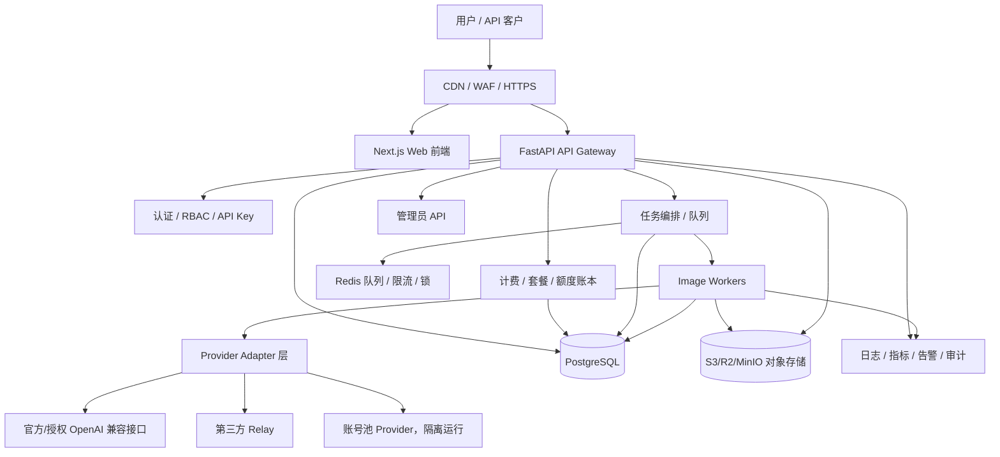

# 图像生成服务商业化/正式对外设计方案

适用目录：`C:\Users\caiwujiang\Desktop\image`

生成日期：2026-07-06

## 1. 结论

当前项目已经具备“内部使用/演示/小规模内测”的基础能力，但要成为正式对外服务，需要从“脚本式代理 + 本地 JSON 状态”升级为“可审计、可计费、可扩展、可恢复”的 SaaS 架构。

建议商业化版本以 `chatgpt2api-bk` 作为主产品底座：

- 保留它已有的 Next.js 管理前端、注册/登录、用户额度、CDK、API key、账号池、OpenAI 兼容接口。
- 把 `image-gen-demo` 中更成熟的能力吸收进来：任务队列、作品库、使用统计、Relay 配置、CSV 导出、管理员视角。
- `image-gen-demo` 后续作为原型/备用工具，不作为正式公网入口。

## 2. 当前项目定位

### 2.1 `image-gen-demo`

优点：

- 轻量，单 FastAPI 文件即可运行。
- 图片生成、编辑、账号池代理、Relay 路由、用户 key、额度、任务队列、作品库、使用统计都已有雏形。
- 本地测试已通过：`tests.test_admin_features` 共 29 个测试通过。

不足：

- `main.py` 约 2100 行，后续维护成本高。
- 前端是大 HTML + 内联 JS，难以长期迭代。
- 本地 JSON/JSONL 文件不适合作为商业化主存储。
- token 存在 localStorage，公网场景风险偏高。

### 2.2 `chatgpt2api-bk`

优点：

- 已有 Next.js 前端、用户系统、CDK、套餐、权限、API key、账号池管理。
- 已支持 json/sqlite/postgres/git 多存储后端雏形。
- 更适合作为正式产品的主线。

不足：

- 当前 TypeScript 检查失败。
- ESLint 有错误。
- 测试分层不清晰，单元测试和需要真实服务的集成测试混在一起。
- 当前依赖、运行环境、数据文件、仓库结构还没有达到生产收口状态。

## 3. 商业化目标架构



## 4. 服务拆分建议

### 4.1 正式公网入口

只暴露一个主域名，例如：

- `https://img.example.com`：Web 前端和用户控制台。
- `https://api.example.com`：OpenAI 兼容 API，可选。

也可以先用一个域名：

- `/`：Web。
- `/v1/*`：OpenAI 兼容 API。
- `/api/*`：业务 API。
- `/admin/*`：管理员后台。

### 4.2 后端模块

建议将 `chatgpt2api-bk` 后端拆成这些包：

```text
api/
  routes/
    auth.py
    users.py
    api_keys.py
    images.py
    jobs.py
    gallery.py
    billing.py
    admin.py
    provider_accounts.py
services/
  auth_service.py
  quota_service.py
  billing_service.py
  job_service.py
  image_service.py
  provider_router.py
  provider_adapters/
    openai_compatible.py
    relay.py
    account_pool.py
  audit_service.py
  notification_service.py
storage/
  models.py
  migrations/
workers/
  image_worker.py
  maintenance_worker.py
```

### 4.3 `image-gen-demo` 能力迁移清单

从 `C:\Users\caiwujiang\Desktop\image\image-gen-demo` 迁移到主项目：

- `/api/jobs/*` 服务端任务队列。
- `/api/gallery/*` 作品库。
- `/api/usage` 使用统计。
- `/api/usage/export.csv` CSV 导出。
- Relay 动态配置。
- 账号池异常清理逻辑。
- 上游 401/403 映射为本服务 502 的错误处理方式。
- SSRF 防护逻辑：图片 URL 下载时禁止内网地址、loopback、link-local。

## 5. 数据存储设计

正式商业化不要再依赖本地 JSON/JSONL 作为主数据源。

### 5.1 PostgreSQL 表设计

核心表：

```text
users
sessions
api_keys
plans
subscriptions
orders
payments
quota_ledger
usage_events
image_jobs
image_assets
provider_configs
provider_accounts
audit_logs
login_attempts
rate_limit_events
```

### 5.2 额度账本

不要只在用户表里做 `quota_balance -= n`。商业化必须有账本：

```text
quota_ledger
- id
- user_id
- type: grant | consume | refund | expire | adjust
- amount
- balance_after
- ref_type: order | job | admin | cdk
- ref_id
- created_at
- created_by
- note
```

好处：

- 可审计。
- 可退款。
- 可追溯用户投诉。
- 可分析收入与成本。
- 可以处理失败任务返还额度。

### 5.3 图片存储

图片不要长期放本地 `data/images`。

建议：

- 开发环境：MinIO。
- 生产环境：Cloudflare R2 / AWS S3 / 阿里 OSS / 腾讯 COS。
- PostgreSQL 只保存 metadata，不保存大图二进制。

`image_assets` 字段建议：

```text
id
user_id
job_id
provider
model
prompt_hash
prompt_preview
object_key
mime_type
size_bytes
width
height
status
created_at
deleted_at
```

## 6. 认证与权限设计

### 6.1 用户认证

正式对外建议支持：

- 邮箱 + 密码。
- 邮箱验证码。
- 找回密码。
- 登录失败限流。
- 管理员 2FA，可后续加。
- Session 使用 HttpOnly Cookie。

不建议公网商业版继续把长期 token 放在 `localStorage` 里。

### 6.2 API Key

API Key 设计：

- 只在创建时显示完整 key。
- 服务端只保存 hash。
- 支持启用/禁用。
- 支持权限范围：`image.generate`、`image.edit`、`gallery.read` 等。
- 支持独立限速。
- 支持过期时间。
- 支持最后使用时间、最后来源 IP。

### 6.3 RBAC

角色建议：

```text
super_admin：系统总管理员
admin：运营管理员
support：客服，只能查用户和订单，不可看密钥
user：普通用户
api_user：仅 API 调用主体
```

## 7. 计费与套餐设计

### 7.1 基础计费模型

建议先做简单可控版本：

- 按张计费：生成 1 张图扣 1 个图像额度。
- 编辑 1 张图扣 1～2 个额度，可配置。
- 不同模型设置不同倍率：
  - 普通模型：1x
  - 高质量模型：2x
  - 多图编辑：按输入图数量或输出图数量加权。

### 7.2 套餐

```text
免费试用包：10 张，有效 7 天
基础包：100 张，有效 30 天
专业包：1000 张，有效 30/90 天
企业包：人工开通，可自定义并发和模型
```

### 7.3 支付

国内用户优先：

- 支付宝当面付 / 支付宝开放平台。
- 微信支付。

海外用户：

- Stripe。

第一版也可以先保留 CDK 充值，人工收款后发码，等业务跑通再接自动支付。

### 7.4 订单状态

```text
created -> pending_payment -> paid -> fulfilled
created -> cancelled
paid -> refunded
paid -> partially_refunded
```

## 8. 任务队列与生成流程

正式版建议所有耗时生图走异步任务。

### 8.1 同步 API

OpenAI 兼容接口可以继续支持同步返回，但内部仍建议：

1. 创建 job。
2. Worker 执行。
3. 同步请求等待一定时间。
4. 超时则返回 job id，让用户轮询。

### 8.2 任务状态

```text
queued
running
succeeded
partially_succeeded
failed
cancelled
refunded
```

### 8.3 并发控制

需要三层限流：

- 用户级：每分钟请求数、并发任务数。
- 系统级：总并发 Worker 数。
- Provider 级：每个上游/账号池的并发和失败熔断。

建议使用 Redis 实现：

- rate limit counter。
- job queue。
- distributed lock。
- provider health cache。

## 9. Provider Adapter 设计

商业化后不要让业务代码直接调用某一个上游。统一走 Provider Adapter：

```python
class ImageProvider:
    async def generate(self, request) -> ProviderResult: ...
    async def edit(self, request) -> ProviderResult: ...
    async def health(self) -> ProviderHealth: ...
```

Provider 类型：

- `openai_compatible`：官方或授权 OpenAI 兼容接口。
- `relay`：第三方中转。
- `account_pool`：账号池能力，单独隔离，避免影响主服务稳定性。

Provider Router 根据：

- 模型。
- 用户套餐。
- 成本。
- 健康状态。
- 失败率。
- 并发。

选择上游。

## 10. 安全加固清单

### 10.1 必做

- 全站 HTTPS。
- HSTS。
- CORS 生产环境只允许正式域名。
- 管理端独立路径或独立域名。
- 管理员 2FA。
- API key/hash 存储。
- 密码使用 Argon2id 或 bcrypt。
- 上传图片魔数校验。
- 图片下载保留现有 SSRF 防护，并增加 DNS rebinding 防护。
- 所有管理操作写 audit log。
- 统一错误响应，不暴露上游密钥、access_token、内部路径。
- Secret 从环境变量或密钥管理读取，不进入 Git。
- GitHub Actions / CI 里加 secret scanning。

### 10.2 建议做

- 内容安全策略 CSP。
- 管理后台 IP allowlist，可选。
- 风控规则：异常高频、失败率异常、同 IP 多账号注册。
- 用户内容审计队列。
- 图片生命周期策略：自动过期删除。
- 数据备份加密。

## 11. 日志、监控与告警

### 11.1 日志

使用结构化 JSON 日志：

```json
{
  "time": "2026-07-06T12:00:00Z",
  "level": "info",
  "event": "image_job_completed",
  "job_id": "...",
  "user_id": "...",
  "provider": "...",
  "model": "...",
  "latency_ms": 12345,
  "cost_units": 1
}
```

敏感字段必须脱敏。

### 11.2 指标

至少监控：

- 请求 QPS。
- 生成成功率。
- 上游失败率。
- 平均耗时 / P95 / P99。
- 队列长度。
- Worker 数量。
- 用户额度消耗。
- 每日收入和成本。
- 账号池可用数量。

### 11.3 告警

- 成功率低于阈值。
- 上游 401/403 激增。
- 队列积压。
- Redis/Postgres/S3 不可用。
- 磁盘空间不足。
- 支付回调失败。

## 12. 部署架构

### 12.1 单机商业版 MVP

适合初期：

```text
Caddy/Nginx
PostgreSQL
Redis
FastAPI API
Next.js static/out
Image Worker
MinIO 或外部对象存储
```

Docker Compose 服务：

```text
caddy
api
worker
postgres
redis
minio 或外部 S3
```

### 12.2 后续扩展版

当用户量增加：

- API 多副本。
- Worker 多副本。
- Redis 托管版。
- Postgres 托管版。
- 对象存储托管版。
- CDN 加速图片访问。
- 灰度发布。

## 13. CI/CD 与质量门禁

### 13.1 每次提交必须通过

后端：

```powershell
python -m compileall -q main.py api services utils test
python -m unittest discover -s test -t .
```

前端：

```powershell
npm run build
npx tsc --noEmit
npx eslint .
```

当前必须先修：

- `web/src/app/logs/page.tsx` TypeScript 类型错误。
- ESLint 的 6 个 error。
- Python 测试缺少 `httpx`。
- 集成测试访问 `localhost:8000` 的用例需要加标记或单独脚本。

### 13.2 测试分层

建议：

```text
test/unit/：纯单元测试，不访问网络
test/api/：FastAPI TestClient 测试
test/integration/：需要真实服务/真实上游，默认不跑
test/e2e/：Playwright 浏览器测试
```

## 14. 阶段性实施路线

### Phase 0：仓库与敏感信息清理，0.5～1 天

- 清理根仓库暂存内容。
- 移除 `.env`、`_auth.json`、`*.db`、`cookies.txt`、`*.exe`、`.claude`。
- 明确主仓库：建议 `chatgpt2api-bk` 为主线。
- 写统一 `.gitignore`。
- 修复乱码文档，统一 UTF-8。

交付标准：仓库可以安全 push，不含敏感运行数据。

### Phase 1：质量收口，1～3 天

- 修复 TypeScript 错误。
- 修复 ESLint error。
- 安装并锁定测试依赖。
- 拆分单元测试和集成测试。
- 增加 CI。

交付标准：本地和 CI 全绿。

### Phase 2：生产存储，2～4 天

- PostgreSQL 作为主存储。
- Alembic 或等价 migration 体系。
- Redis 用于限流、队列、锁。
- S3/R2/MinIO 用于图片。
- JSON/JSONL 只保留迁移工具。

交付标准：重启服务不丢数据，多实例不会额度错乱。

### Phase 3：商业账户与计费，3～7 天

- 用户注册、邮箱验证、找回密码。
- 套餐、订单、支付回调。
- 额度账本。
- CDK 作为人工充值方案保留。
- 用户控制台展示订单、额度、作品、API key。

交付标准：用户可以自助注册、充值、生成、查看余额。

### Phase 4：任务队列与图片管线，3～6 天

- Redis 队列或 RQ/Celery/Arq。
- Worker 执行生成。
- Job 状态查询。
- 失败重试和失败退款。
- Provider 健康检查和熔断。

交付标准：高峰时请求不会阻塞 API，失败可追踪可退款。

### Phase 5：安全与运维，3～5 天

- HttpOnly Cookie session。
- API key hash 存储。
- 管理端 RBAC 和 audit log。
- CSP/HSTS/CORS 收紧。
- 监控、告警、备份。
- 生产 Docker Compose。

交付标准：可对外灰度开放。

### Phase 6：商业化优化，持续迭代

- 邀请码 / 推广码。
- 企业套餐。
- 发票/收据。
- 成本报表。
- 多 Provider 成本路由。
- 用户工单系统。

## 15. 正式上线 Definition of Done

满足下面条件再正式对外：

- [ ] 仓库不含敏感文件。
- [ ] 后端测试通过。
- [ ] 前端 build、tsc、eslint 通过。
- [ ] 生产环境使用 PostgreSQL。
- [ ] 生产环境使用 Redis。
- [ ] 图片存储使用 S3/R2/OSS/COS。
- [ ] API key 只保存 hash。
- [ ] 密码安全 hash。
- [ ] 管理操作有审计日志。
- [ ] 额度扣减有账本。
- [ ] 失败任务能退款。
- [ ] 支付回调幂等。
- [ ] CORS 只允许正式域名。
- [ ] HTTPS/HSTS 配置完成。
- [ ] 日志脱敏。
- [ ] 每日自动备份。
- [ ] 有监控和告警。
- [ ] 有用户协议、隐私政策、退款说明。

## 16. 推荐下一步执行顺序

马上做：

1. 以 `chatgpt2api-bk` 为商业化主线。
2. 先修 `web` 的 TypeScript 和 ESLint。
3. 清理根 Git 仓库和敏感文件。
4. 建立 `test/unit` 与 `test/integration` 分层。
5. 开始把本地 JSON 状态迁移到 PostgreSQL。

建议不要一开始就接复杂支付。第一版可以：

- 管理员创建套餐/CDK。
- 人工收款后发 CDK。
- 用户兑换 CDK 获得额度。

等真实用户流程跑顺后，再接支付宝/微信/Stripe 自动支付。
